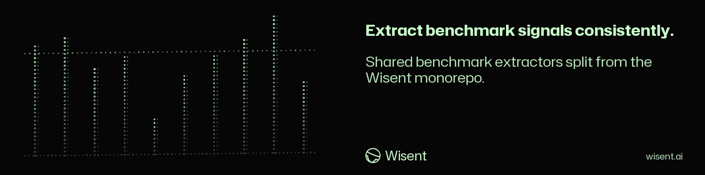

<!-- wisent-banner:start -->
<p align="center">
  
</p>
<!-- wisent-banner:end -->

<!-- wisent-readme-signals:start -->
[](https://github.com/wisent-ai/wisent-extractors) [](https://github.com/wisent-ai/wisent-extractors/issues) [](https://wisent.ai) [](https://discord.gg/qRjpkthq54) [](https://www.linkedin.com/company/wisent-ai/) [](https://x.com/wisentai) [](https://calendly.com/lbartoszcze)
<!-- wisent-readme-signals:end -->

# wisent-extractors

Benchmark extractors split out of the [wisent](https://github.com/wisent-ai/wisent)
monorepo. Contains:

- `wisent.extractors.lm_eval` — 676 extractors for lm-eval-harness tasks
- `wisent.extractors.hf` — 223 extractors for wisent-proprietary HuggingFace benchmarks

## Install

```
pip install wisent-extractors
```

## Usage

```python
from wisent.extractors.lm_eval.registry.lm_extractor_registry import get_extractor

extractor = get_extractor("gsm8k")
pairs = extractor.extract_contrastive_pairs(limit=100)
```

## Namespace packaging

This package is a namespace package that shares the `wisent.*` import root
with `wisent-core` and `wisent-evaluators`. All three can be installed
side-by-side without conflict.