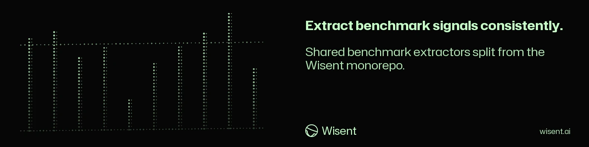

<!-- wisent-banner:start -->
<p align="center">
  
</p>
<!-- wisent-banner:end -->

<!-- wisent-readme-signals:start -->
[](https://github.com/wisent-ai/wisent-extractors) [](https://github.com/wisent-ai/wisent-extractors/issues) [](https://wisent.com) [](https://discord.gg/qRjpkthq54) [](https://www.linkedin.com/company/wisent-ai/) [](https://x.com/wisentai) [](https://calendly.com/lbartoszcze)
<!-- wisent-readme-signals:end -->

# wisent-extractors (superseded)

This repository held `wisent-extractors`, a Python package with one extractor
per benchmark — lm-eval-harness tasks under `wisent.extractors.lm_eval` and
HuggingFace datasets under `wisent.extractors.hf` — each turning a benchmark's
rows into contrastive pairs. It imported its pair types, logger and model
wrapper from the `wisent` package (`wisent.core…`), which the Rust cutover
replaced with [Ster](https://github.com/wisent-ai/ster), so none of it could
be imported any longer; the fleet holds no Python. The package, its release
manifest and its publishing workflows were removed. The versions already on
PyPI remain as published.

The extractors also decided with numbers and guesses nobody stated: an answer
letter turned into an index by arithmetic, the next choice taken as the wrong
answer, a missing answer read as index zero, a missing toxicity score read as
safe, HaluLens cut at 100 items, a fixed MOCHA score threshold and a fixed
generated BFCL argument. Their replacement guesses none of them.

| `wisent-extractors` | Ster |
|---|---|
| a multiple-choice extractor (ARC, HellaSwag, MMLU, PIQA, …) | `ster pairs import --benchmark choices`, told where the row keeps its question, choices and answer |
| TruthfulQA, Do-Not-Answer, LiveCodeBench | `ster pairs import --benchmark truthfulqa`, `dna`, `livecodebench` |
| an extractor that generated its incorrect side | `ster pairs synthesize`, which writes both sides with a stated model and records how |

Export a dataset's split as JSON Lines (one row per line) and name its schema:

```bash
# ARC-Easy rows: {"question": …, "choices": {"text": [...], "label": ["A", …]}, "answerKey": "B"}
ster pairs import --benchmark choices --source arc_easy.jsonl --seed <SEED> --output arc.pairs.json \
  --question /question --choices /choices/text --answer /answerKey --answer-form label --labels /choices/label
```

`--answer-form` is `index` (the choice's position from zero), `label` (one of
the row's `--labels`) or `text` (the choice itself). A row whose answer is
missing or does not resolve is skipped with its row and reason, and every row
is read unless `--count` keeps fewer. Ster's
[pair-sets guide](https://github.com/wisent-ai/ster/blob/main/docs/guide/pair-sets.md)
lists the refusals; the pair set it writes is what `ster train`,
`ster optimize` and `ster evaluate` read.
